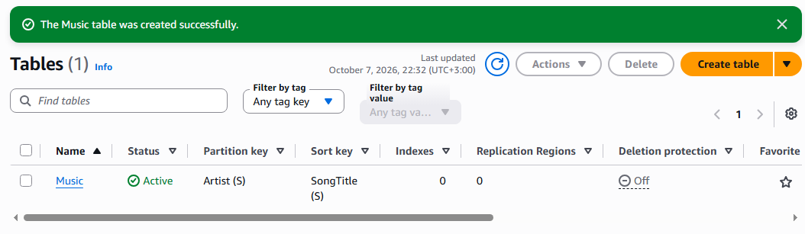
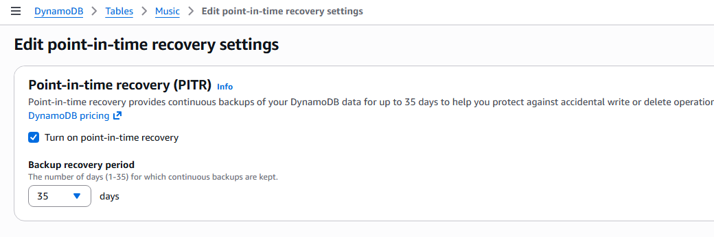
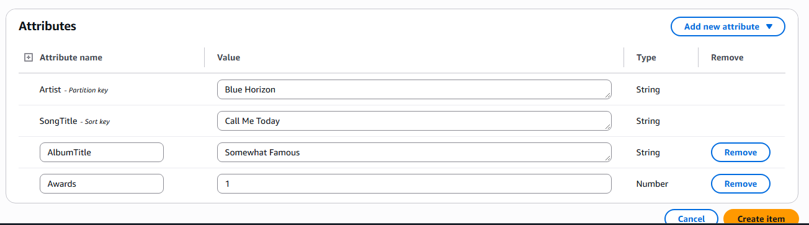
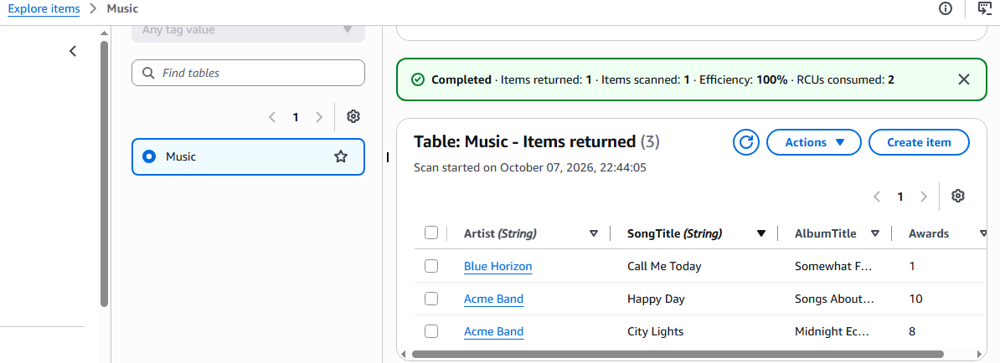
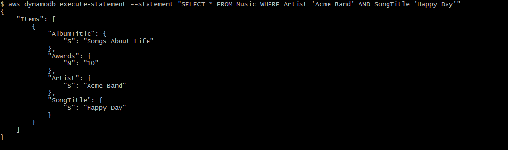
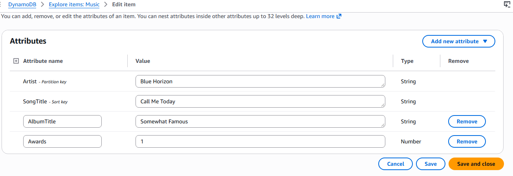
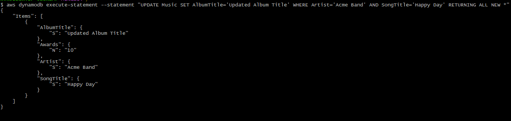
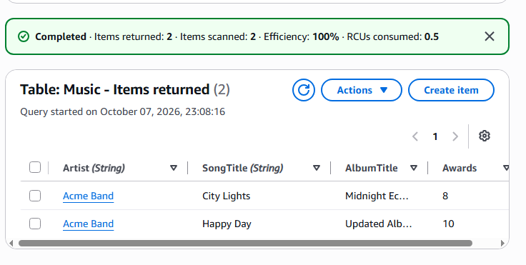
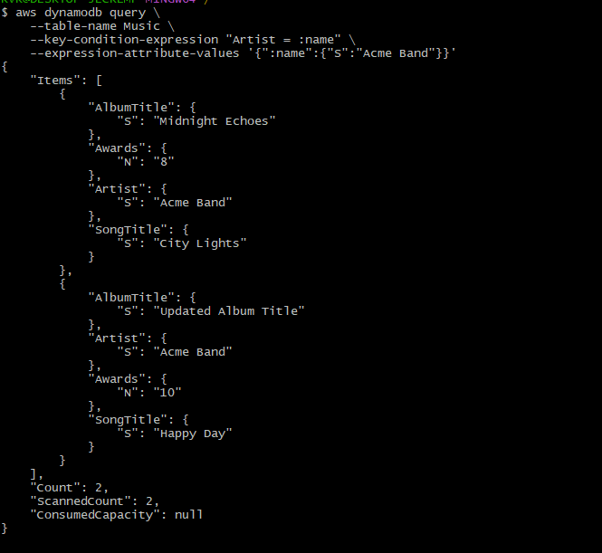
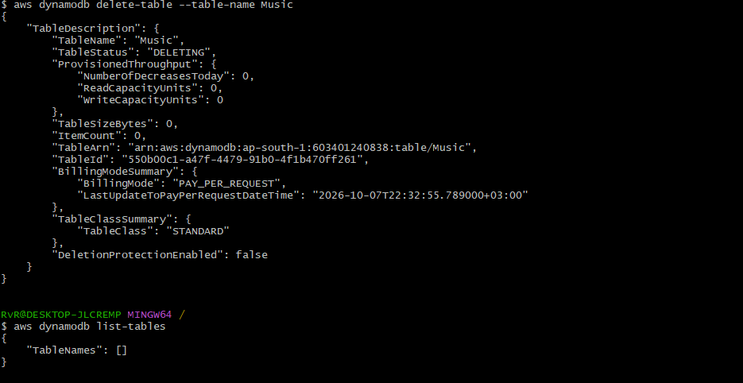

# Amazon DynamoDB: Non-Relational Databases & Getting Started Lab

A hands-on introduction to NoSQL (non-relational) databases and **Amazon DynamoDB**, AWS's fully managed key-value and document database. The first half is a short research summary; the second half is a lab where we create a `Music` table, write, read, update and query data, and clean up, using both the **AWS Console** and the **AWS CLI**.

> Lab source: [AWS Docs: Getting started with DynamoDB](https://docs.aws.amazon.com/amazondynamodb/latest/developerguide/GettingStartedDynamoDB.html)

---

## Table of Contents

1. [Part 1: Research](#part-1-research)
   - [Non-relational databases](#non-relational-databases)
   - [Amazon DynamoDB](#amazon-dynamodb)
2. [Part 2: Lab](#part-2-lab)
   - [Objective](#objective)
   - [Prerequisites](#prerequisites)
   - [Architecture / data model](#architecture--data-model)
   - [Step 1: Create a table](#step-1-create-a-table)
   - [Step 2: Write data](#step-2-write-data)
   - [Step 3: Read data](#step-3-read-data)
   - [Step 4: Update data](#step-4-update-data)
   - [Step 5: Query data](#step-5-query-data)
   - [Step 6: Clean up](#step-6-clean-up)
3. [Key Learnings](#key-learnings)
4. [Troubleshooting](#troubleshooting)
5. [References](#references)

---

# Part 1: Research

## Non-relational databases

A **non-relational (NoSQL) database** is a database that doesn't force your data into fixed tables of rows and columns, like a spreadsheet. Each record can have its own shape, so two records in the same collection can have different fields.

People choose NoSQL because it:

- **Adapts easily:** you can add new fields without redesigning the whole database (a *flexible schema*).
- **Grows by adding servers:** when traffic increases, data is spread across more machines instead of buying one bigger machine (*horizontal scaling*).
- **Stays fast:** it responds quickly even with huge amounts of data.

**The trade-off:** to stay fast and always available, some NoSQL databases may show slightly out-of-date data for a moment after an update (*eventual consistency*, part of the so-called BASE model).

| Type | Data model | Examples |
|---|---|---|
| **Key-value** | Key mapped to a value | DynamoDB, Redis |
| **Document** | JSON-like documents | DynamoDB, MongoDB |
| **Wide-column** | Rows with dynamic columns | Cassandra, HBase |
| **Graph** | Nodes and edges | Neo4j, Amazon Neptune |

**SQL vs NoSQL in short:** SQL databases use a fixed schema, combine data from different tables using *joins* (for example, matching customers with their orders), and mostly scale *vertically* (by moving to a bigger, more powerful server). NoSQL databases use flexible schemas, keep related data together in one record (*denormalized*), and scale *horizontally* (by adding more servers).

## Amazon DynamoDB

**Amazon DynamoDB** is a fully managed, serverless NoSQL database (key-value and document) that delivers single-digit millisecond performance at any scale. AWS handles servers, patching, replication and scaling.

**Core concepts**

| Concept | Description |
|---|---|
| **Table / Item / Attribute** | Collection of records / one record / one data element (like table, row, column). |
| **Partition key** | Hashed to decide where an item is stored. Required. |
| **Sort key** | Optional. Orders items that share a partition key. |
| **Secondary indexes** | GSI and LSI allow extra query patterns. |
| **PartiQL** | SQL-compatible query language for DynamoDB. |

**Key features:** on-demand or provisioned capacity, eventually or strongly consistent reads, ACID transactions, point-in-time recovery and backups, encryption at rest, Streams, TTL, Global Tables and DAX caching.

**Good for:** serverless backends, sessions, carts, gaming, IoT and any workload needing predictable low latency.

**Limitations:** no joins, so data must be modelled around access patterns. `Scan` is slow and costly on large tables, and items are limited to 400 KB.

---

# Part 2: Lab

## Objective

Create an Amazon DynamoDB table, then perform the basic data operations (create, read, update, query) using the **AWS Management Console** and the **AWS CLI**, and finally delete the table to avoid charges.

## Prerequisites

- An AWS account (the [AWS Free Tier](https://aws.amazon.com/free/) covers this lab as long as you haven't exceeded the DynamoDB free tier limits).
- Access to the DynamoDB console: <https://console.aws.amazon.com/dynamodb/>
- *(For CLI steps)* [AWS CLI](https://docs.aws.amazon.com/cli/latest/userguide/getting-started-install.html) installed and configured with `aws configure`, using credentials that have DynamoDB permissions.
- *(Optional)* [DynamoDB Local](https://docs.aws.amazon.com/amazondynamodb/latest/developerguide/DynamoDBLocal.html) if you don't want to use an AWS account.

> **Cost note:** The table uses on-demand billing. Enabling point-in-time recovery has its own cost. Delete the table in Step 6 when you are done.

## Architecture / data model

We create one table named **`Music`**:

| Attribute | Role | Type |
|---|---|---|
| `Artist` | Partition key | String |
| `SongTitle` | Sort key | String |
| `AlbumTitle` | Regular attribute | String |
| `Awards` | Regular attribute | Number |

```
Music table
├── Artist = "Blue Horizon"
│   └── SongTitle = "Call Me Today"  → AlbumTitle: "Somewhat Famous", Awards: 1
└── Artist = "Acme Band"
    ├── SongTitle = "Happy Day"      → AlbumTitle: "Songs About Life", Awards: 10
    └── SongTitle = "City Lights"  → AlbumTitle: "Midnight Echoes", Awards: 8
```

---

## Step 1: Create a table

### Using the Console

1. Sign in to the AWS Management Console and open the DynamoDB console.
2. In the left navigation pane, choose **Tables**.
3. Choose **Create table**.
4. Enter the table details:
   - **Table name:** `Music`
   - **Partition key:** `Artist` (String)
   - **Sort key:** `SongTitle` (String)
5. Keep **Default settings** under **Table settings**.
6. Choose **Create table**.



7. When the table status is **Active**, enable **point-in-time recovery (PITR)**:
   1. Open the `Music` table → **Backups**.
   2. In the **Point-in-time recovery (PITR)** section, choose **Edit**.
   3. Choose **Turn on point-in-time recovery** → **Save changes**.



### Using the CLI

```bash
aws dynamodb create-table \
    --table-name Music \
    --attribute-definitions \
        AttributeName=Artist,AttributeType=S \
        AttributeName=SongTitle,AttributeType=S \
    --key-schema AttributeName=Artist,KeyType=HASH AttributeName=SongTitle,KeyType=RANGE \
    --billing-mode PAY_PER_REQUEST \
    --table-class STANDARD
```

Right after creation `TableStatus` is `CREATING`. Check until it is `ACTIVE`:

```bash
aws dynamodb describe-table --table-name Music | grep TableStatus
```

Expected output:

```
"TableStatus": "ACTIVE",
```

Then enable PITR:

```bash
aws dynamodb update-continuous-backups \
    --table-name Music \
    --point-in-time-recovery-specification PointInTimeRecoveryEnabled=true
```

---

## Step 2: Write data

> Use **either** the Console, the DynamoDB API, **or** PartiQL for this step. Inserting the same key twice with PartiQL `INSERT` fails with a duplicate-item error, whereas `put-item` overwrites.

### Using the Console

1. Open the `Music` table → **Explore table items**.
2. In **Items returned**, choose **Create item**.
3. Choose **Add new attribute** → **Number** and name it `Awards`. Repeat to add `AlbumTitle` as a **String**.
4. Create three items:

| Artist | SongTitle | AlbumTitle | Awards |
|---|---|---|---|
| Blue Horizon | Call Me Today | Somewhat Famous | 1 |
| Acme Band | Happy Day | Songs About Life | 10 |
| Acme Band | City Lights | Midnight Echoes | 8 |

5. Choose **Create item** after each one.



### Using the CLI: DynamoDB API (`put-item`)

```bash
aws dynamodb put-item \
    --table-name Music \
    --item \
        '{"Artist": {"S": "Blue Horizon"}, "SongTitle": {"S": "Call Me Today"}, "AlbumTitle": {"S": "Somewhat Famous"}, "Awards": {"N": "1"}}'

aws dynamodb put-item \
    --table-name Music \
    --item \
        '{"Artist": {"S": "Blue Horizon"}, "SongTitle": {"S": "Howdy"}, "AlbumTitle": {"S": "Somewhat Famous"}, "Awards": {"N": "2"}}'

aws dynamodb put-item \
    --table-name Music \
    --item \
        '{"Artist": {"S": "Acme Band"}, "SongTitle": {"S": "Happy Day"}, "AlbumTitle": {"S": "Songs About Life"}, "Awards": {"N": "10"}}'

aws dynamodb put-item \
    --table-name Music \
    --item \
        '{"Artist": {"S": "Acme Band"}, "SongTitle": {"S": "City Lights"}, "AlbumTitle": {"S": "Midnight Echoes"}, "Awards": {"N": "8"}}'
```

### Using the CLI: PartiQL (`execute-statement`)

```bash
aws dynamodb execute-statement --statement "INSERT INTO Music VALUE {'Artist':'Blue Horizon','SongTitle':'Call Me Today', 'AlbumTitle':'Somewhat Famous', 'Awards':'1'}"

aws dynamodb execute-statement --statement "INSERT INTO Music VALUE {'Artist':'Blue Horizon','SongTitle':'Howdy', 'AlbumTitle':'Somewhat Famous', 'Awards':'2'}"

aws dynamodb execute-statement --statement "INSERT INTO Music VALUE {'Artist':'Acme Band','SongTitle':'Happy Day', 'AlbumTitle':'Songs About Life', 'Awards':'10'}"

aws dynamodb execute-statement --statement "INSERT INTO Music VALUE {'Artist':'Acme Band','SongTitle':'City Lights', 'AlbumTitle':'Midnight Echoes', 'Awards':'8'}"
```

> **Note:** In the PartiQL statements above `Awards` is quoted (`'1'`), so it is stored as a **String**, while `put-item` with `{"N": "1"}` stores a **Number**. This is why the sample outputs in Steps 3 and 4 show `"Awards": {"S": "10"}` for PartiQL-inserted data.

---

## Step 3: Read data

### Using the Console

1. Open the `Music` table → **Explore table items**.
2. In **Items returned**, review the items, sorted by `Artist` and then `SongTitle`.



### Using the CLI: `get-item` (strongly consistent read)

```bash
aws dynamodb get-item --consistent-read \
    --table-name Music \
    --key '{ "Artist": {"S": "Acme Band"}, "SongTitle": {"S": "Happy Day"}}'
```

Sample output:

```json
{
    "Item": {
        "AlbumTitle": { "S": "Songs About Life" },
        "Awards": { "S": "10" },
        "Artist": { "S": "Acme Band" },
        "SongTitle": { "S": "Happy Day" }
    }
}
```

### Using the CLI: PartiQL `SELECT`

```bash
aws dynamodb execute-statement --statement "SELECT * FROM Music WHERE Artist='Acme Band' AND SongTitle='Happy Day'"
```

> `get-item` needs the **full primary key** (partition + sort key) and returns at most one item. The default read is eventually consistent; `--consistent-read` forces a strongly consistent read.



---

## Step 4: Update data

We change the `AlbumTitle` of the **Acme Band: Happy Day** item.

### Using the Console

1. Open the `Music` table → **Explore table items**.
2. On the row for **Acme Band / Happy Day**, hover over **AlbumTitle** (`Songs About Life`) and choose the **Edit** icon.
3. Enter `Songs of Twilight` and choose **Save**.

*Alternative:* select the row → **Actions** → **Edit item** → change **AlbumTitle** → **Save and close**.



### Using the CLI: `update-item`

```bash
aws dynamodb update-item \
    --table-name Music \
    --key '{ "Artist": {"S": "Acme Band"}, "SongTitle": {"S": "Happy Day"}}' \
    --update-expression "SET AlbumTitle = :newval" \
    --expression-attribute-values '{":newval":{"S":"Updated Album Title"}}' \
    --return-values ALL_NEW
```

### Using the CLI: PartiQL `UPDATE`

```bash
aws dynamodb execute-statement --statement "UPDATE Music SET AlbumTitle='Updated Album Title' WHERE Artist='Acme Band' AND SongTitle='Happy Day' RETURNING ALL NEW *"
```

`--return-values ALL_NEW` (or `RETURNING ALL NEW *`) returns the item as it looks **after** the update:

```json
{
    "Attributes": {
        "AlbumTitle": { "S": "Updated Album Title" },
        "Awards": { "S": "10" },
        "Artist": { "S": "Acme Band" },
        "SongTitle": { "S": "Happy Day" }
    }
}
```



---

## Step 5: Query data

A **query** retrieves all items that share a partition key value (optionally narrowed by a sort-key condition). Here we fetch every song by **Acme Band**.

### Using the Console

1. Open the `Music` table → **Explore table items**.
2. Under **Scan or query items**, make sure **Query** is selected.
3. In **Partition key**, enter `Acme Band` and choose **Run**.



### Using the CLI: `query`

```bash
aws dynamodb query \
    --table-name Music \
    --key-condition-expression "Artist = :name" \
    --expression-attribute-values '{":name":{"S":"Acme Band"}}'
```

Sample output:

```json
{
    "Items": [
        {
            "AlbumTitle": { "S": "Updated Album Title" },
            "Awards": { "N": "10" },
            "Artist": { "S": "Acme Band" },
            "SongTitle": { "S": "Happy Day" }
        },
        {
            "AlbumTitle": { "S": "Midnight Echoes" },
            "Awards": { "N": "8" },
            "Artist": { "S": "Acme Band" },
            "SongTitle": { "S": "City Lights" }
        }
    ],
    "Count": 2,
    "ScannedCount": 2,
    "ConsumedCapacity": null
}
```

### Using the CLI: PartiQL `SELECT`

```bash
aws dynamodb execute-statement --statement "SELECT * FROM Music WHERE Artist='Acme Band'"
```

> Query vs Scan: **Query** targets one partition key and is efficient. **Scan** reads every item in the table and should be avoided on large tables.



---

## Step 6: Clean up

Delete the table to stop incurring charges (including PITR backup costs).

### Using the Console

1. Open the DynamoDB console → **Tables**.
2. Select the `Music` table → **Delete**.
3. Review the confirmation options, confirm, and choose **Delete table**.


> **Note: system backup.** If you keep the option to create a backup before deleting, DynamoDB creates a **system backup** of the table. It is managed by AWS, so you can't delete it manually (trying gives *"User is not allowed to delete the system backup"*). It expires automatically after **1 day**, and the cost is negligible for a small table. If you want to test restoring the table, do it from the **Backups** page within that 1 day. If you don't need a backup, untick the option when deleting.

### Using the CLI

```bash
aws dynamodb delete-table --table-name Music
```

Verify that the table is gone:

```bash
aws dynamodb list-tables
```



---

# Key Learnings

- DynamoDB is a **serverless key-value/document store**: no servers, patching or capacity planning in on-demand mode.
- The **primary key design** (partition key + sort key) drives how data is stored and which queries are efficient.
- **`get-item`** needs the full primary key, **`query`** needs the partition key, and **`scan`** reads everything.
- DynamoDB can be used through the **console, CLI/API (JSON attribute-value syntax) or PartiQL** (SQL-like).
- **Strongly consistent reads** return the latest data but cost more than the default eventually consistent reads.
- Data type matters: `{"N": "1"}` (Number) and `'1'` in PartiQL (String) are stored differently.
- Always **clean up** resources to avoid unnecessary charges.

# Troubleshooting

| Problem | Likely cause / fix |
|---|---|
| `Unable to locate credentials` | Run `aws configure` and provide an access key, secret key and default Region. |
| `AccessDeniedException` | The IAM user/role lacks DynamoDB permissions (for example `dynamodb:CreateTable`, `PutItem`, `Query`). |
| `ResourceNotFoundException` | Wrong table name or Region. Check `aws configure get region` and the console Region selector. |
| `ResourceInUseException` on create | A table named `Music` already exists in that Region. |
| `Duplicate primary key exists in table` (PartiQL insert) | The item was already inserted. Use `UPDATE`, or delete the item first. |
| Table not found right after creation | Wait for `TableStatus` to become `ACTIVE`. |
| JSON quoting errors on Windows CMD | Escape inner quotes (`\"`) and use `^` for line continuation. The AWS docs show Windows variants. |

# References

- [Getting started with DynamoDB](https://docs.aws.amazon.com/amazondynamodb/latest/developerguide/GettingStartedDynamoDB.html)
- [What is Amazon DynamoDB?](https://docs.aws.amazon.com/amazondynamodb/latest/developerguide/Introduction.html)
- [Core components of Amazon DynamoDB](https://docs.aws.amazon.com/amazondynamodb/latest/developerguide/HowItWorks.CoreComponents.html)
- [Step 1: Create a table](https://docs.aws.amazon.com/amazondynamodb/latest/developerguide/getting-started-step-1.html)
- [Step 2: Write data](https://docs.aws.amazon.com/amazondynamodb/latest/developerguide/getting-started-step-2.html)
- [Step 3: Read data](https://docs.aws.amazon.com/amazondynamodb/latest/developerguide/getting-started-step-3.html)
- [Step 4: Update data](https://docs.aws.amazon.com/amazondynamodb/latest/developerguide/getting-started-step-4.html)
- [Step 5: Query data](https://docs.aws.amazon.com/amazondynamodb/latest/developerguide/getting-started-step-5.html)
- [Step 6: Clean up](https://docs.aws.amazon.com/amazondynamodb/latest/developerguide/getting-started-step-6.html)
- [PartiQL for DynamoDB](https://docs.aws.amazon.com/amazondynamodb/latest/developerguide/ql-reference.html)
- [DynamoDB pricing](https://aws.amazon.com/dynamodb/pricing)

---

## Author

**Sinsha C**
 
## Connect

If you're on a similar DevOps learning journey, feel free to connect or follow along:

[](https://github.com/sinsha-c)
[](https://linkedin.com/in/sinshac)
