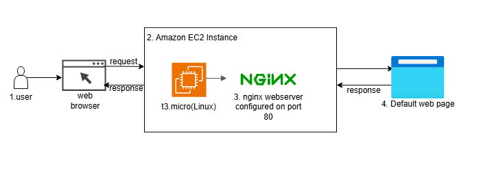
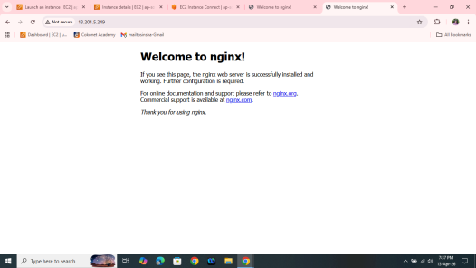

# Nginx Server Setup on AWS EC2 (Amazon Linux, Ubuntu & Red Hat)

## Project Overview
This mini project demonstrates how to set up and configure an **Nginx web server** on different Linux-based EC2 instances using AWS:

- Amazon Linux 2
- Ubuntu
- Red Hat Enterprise Linux (RHEL)

The setup includes both:
- Manual installation steps
- Automated deployment using **EC2 User Data (Bash script)**

---
## Architecture Diagram



---
## Objectives
- Launch EC2 instances using different Linux AMIs
- Install and configure Nginx web server
- Verify Nginx default page via browser
- Automate setup using user data scripts

---

## Expected Outcome
- Nginx is successfully installed and running on all instances
- Accessing `http://<Public-IP>` shows the **default Nginx web page**
- Setup is automated using user data scripts (no manual installation required)

---

## Prerequisites

Before starting, ensure the following:

1. AWS account with access to EC2 service
2. Preferred AWS region (e.g., Mumbai)
3. Key Pair created in the selected region
4. Security Group configured with:
   - SSH (Port 22)
   - HTTP (Port 80)
5. Basic knowledge of Linux commands

---

## 🖥️ EC2 Instance Setup

1. Go to AWS Console → EC2 Service
2. Click **Launch Instance**
3. Select the following AMIs:
   - Amazon Linux 2
   - Ubuntu Server
   - Red Hat Enterprise Linux
4. Attach:
   - Key Pair
   - Security Group (SSH + HTTP enabled)
5. Launch the instance

---
 
## Security Group Configuration
 
| Type  | Protocol | Port Range | Source            | Purpose                  |
|-------|----------|------------|-------------------|---------------------------|
| SSH   | TCP      | 22         | My IP             | Remote administration     |
| HTTP  | TCP      | 80         | 0.0.0.0/0         | Public access to Nginx    |
 
Apply this Security Group to all three instances before proceeding.
 
---


## Part 1: Manual Installation
 
Connect to each instance via SSH before running the commands:
 
```bash
ssh -i your-key.pem ec2-user@<instance-public-ip>   # Amazon Linux 2 / RHEL
ssh -i your-key.pem ubuntu@<instance-public-ip>      # Ubuntu
```
 
### Amazon Linux 2
 
```bash
# 1. Update system packages
sudo yum update -y
 
# 2. Enable and install Nginx from the Amazon Linux Extras repository
sudo amazon-linux-extras enable nginx1
sudo yum clean metadata
sudo yum install nginx -y
 
# 3. Start Nginx and enable it on boot
sudo systemctl start nginx
sudo systemctl enable nginx
 
# 4. (Optional) Customize the landing page
echo "<h1>Hello from Amazon Linux 2 + Nginx</h1>" | sudo tee /usr/share/nginx/html/index.html
 
# 5. Check status
sudo systemctl status nginx
```
 
### Ubuntu
 
```bash
# 1. Update package index
sudo apt update -y
 
# 2. Install Nginx
sudo apt install nginx -y
 
# 3. Start Nginx and enable it on boot
sudo systemctl start nginx
sudo systemctl enable nginx
 
# 4. (Optional) Customize the landing page
echo "<h1>Hello from Ubuntu + Nginx</h1>" | sudo tee /var/www/html/index.html
 
# 5. Check status
sudo systemctl status nginx
 
# 6. (If UFW is active) allow HTTP traffic
sudo ufw allow 'Nginx HTTP'
```

Screeshot:


### RHEL
 
```bash
# 1. Update system packages
sudo dnf update -y
 
# 2. Install Nginx (available via AppStream on RHEL 8/9)
sudo dnf install nginx -y
 
# 3. Start Nginx and enable it on boot
sudo systemctl start nginx
sudo systemctl enable nginx
 
# 4. (Optional) Customize the landing page
echo "<h1>Hello from RHEL + Nginx</h1>" | sudo tee /usr/share/nginx/html/index.html
 
# 5. Check status
sudo systemctl status nginx
 
# 6. (If firewalld is active) allow HTTP traffic
sudo firewall-cmd --permanent --add-service=http
sudo firewall-cmd --reload
```
 
---
 
## Part 2: Automated Deployment via EC2 User Data
 
EC2 **User Data** lets you pass a Bash script that runs automatically as `root` the first time the instance boots. Paste the relevant script into the **"User data"** field under **Advanced details** when launching the instance.
 
### Amazon Linux 2 User Data Script
 
```bash
#!/bin/bash
# Update packages
yum update -y
 
# Install Nginx via Amazon Linux Extras
amazon-linux-extras enable nginx1
yum clean metadata
yum install nginx -y
 
# Start and enable Nginx
systemctl start nginx
systemctl enable nginx
 
# Create a custom index page
cat <<EOF > /usr/share/nginx/html/index.html
<html>
  <head><title>Amazon Linux 2 - Nginx</title></head>
  <body>
    <h1>Deployed via User Data on Amazon Linux 2</h1>
    <p>Instance ID: $(curl -s http://169.254.169.254/latest/meta-data/instance-id)</p>
  </body>
</html>
EOF
```
 
### Ubuntu User Data Script
 
```bash
#!/bin/bash
# Update packages
apt update -y
 
# Install Nginx
apt install nginx -y
 
# Start and enable Nginx
systemctl start nginx
systemctl enable nginx
 
# Create a custom index page
cat <<EOF > /var/www/html/index.html
<html>
  <head><title>Ubuntu - Nginx</title></head>
  <body>
    <h1>Deployed via User Data on Ubuntu</h1>
    <p>Instance ID: $(curl -s http://169.254.169.254/latest/meta-data/instance-id)</p>
  </body>
</html>
EOF
 
# Allow HTTP through UFW if enabled
ufw allow 'Nginx HTTP' || true
```
 
### RHEL User Data Script
 
```bash
#!/bin/bash
# Update packages
dnf update -y
 
# Install Nginx
dnf install nginx -y
 
# Start and enable Nginx
systemctl start nginx
systemctl enable nginx
 
# Open HTTP port in firewalld if active
firewall-cmd --permanent --add-service=http || true
firewall-cmd --reload || true
 
# Create a custom index page
cat <<EOF > /usr/share/nginx/html/index.html
<html>
  <head><title>RHEL - Nginx</title></head>
  <body>
    <h1>Deployed via User Data on RHEL</h1>
    <p>Instance ID: $(curl -s http://169.254.169.254/latest/meta-data/instance-id)</p>
  </body>
</html>
EOF
```
 
> **Note:** The `$(curl -s http://169.254.169.254/latest/meta-data/instance-id)` command queries the EC2 **Instance Metadata Service (IMDS)** to embed the instance ID in the page, which is useful for confirming load-balanced traffic distribution.
 
---
 
## Verification
 
After launching (or configuring) each instance:
 
1. Confirm Nginx is running:
```bash
   sudo systemctl status nginx
```
2. Open a browser and navigate to:
```
   http://<instance-public-ip>
```
3. You should see the custom HTML page for that distribution.
4. Alternatively, test from the terminal:
```bash
   curl http://<instance-public-ip>
```
 
---
 
## Troubleshooting
 
| Issue                                  | Possible Cause                          | Resolution                                                        |
|-----------------------------------------|------------------------------------------|---------------------------------------------------------------------|
| Connection timed out in browser         | Security Group missing port 80 rule       | Add an inbound rule for HTTP (port 80)                              |
| `nginx: command not found`              | Package not installed / wrong repo enabled | Re-run install steps; for Amazon Linux 2 ensure `amazon-linux-extras enable nginx1` ran successfully |
| `Failed to start nginx.service`         | Port 80 already in use                    | Run `sudo ss -tulpn \| grep :80` to find the conflicting process    |
| 403 Forbidden                           | Missing or empty `index.html`             | Ensure `index.html` exists in the correct web root (`/usr/share/nginx/html` or `/var/www/html`) |
| User Data script didn't run             | Script not under "Advanced details" or missing shebang | Confirm `#!/bin/bash` is the first line and check `/var/log/cloud-init-output.log` |
 
---
 
## Cleanup
 
To avoid ongoing AWS charges, terminate the EC2 instances once you're done testing:
 
```bash
aws ec2 terminate-instances --instance-ids <instance-id-1> <instance-id-2> <instance-id-3>
```
 
---
 
