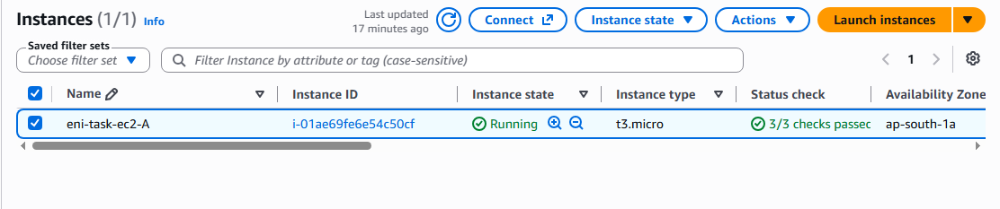
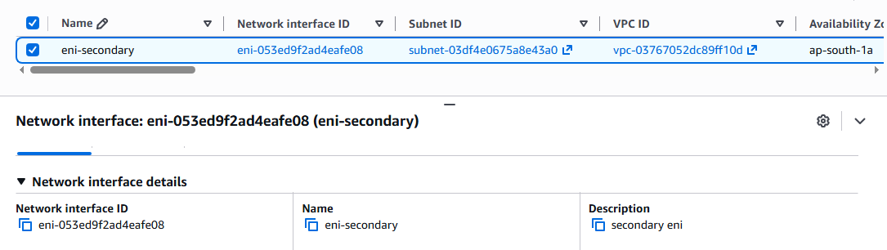
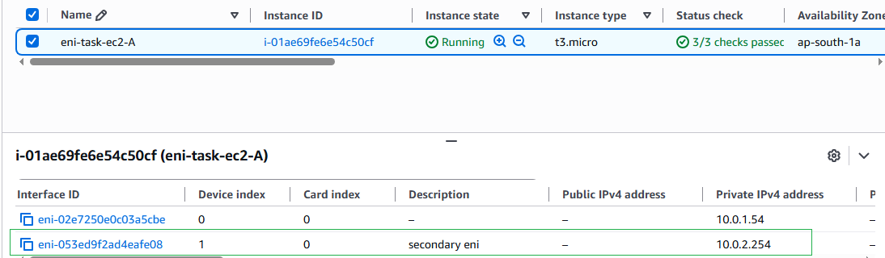
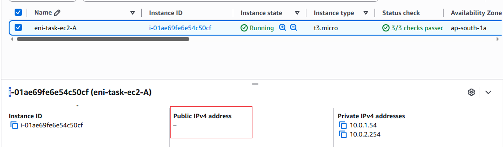
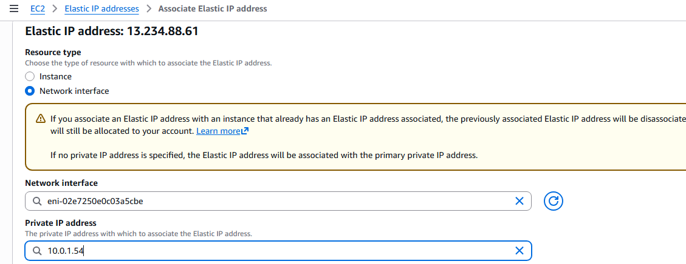
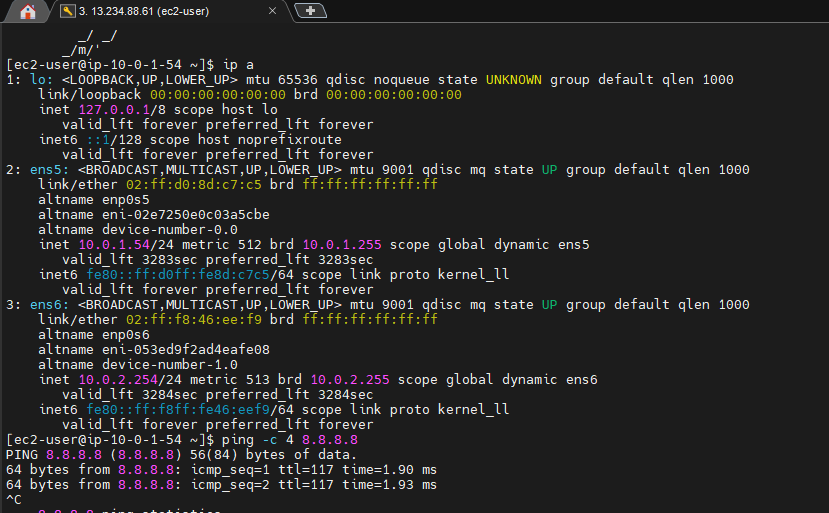

# AWS Secondary ENI + Elastic IP Lab

## Objective
Attach a secondary Elastic Network Interface (ENI) from a different subnet to a public EC2 instance, then use an Elastic IP (EIP) to keep a stable public address and verify accessibility.

## Architecture

| Component | Details |
|-----------|---------|
| Instance | `eni-task-ec2-A` (t3.micro) |
| Availability Zone | ap-south-1a |
| Primary ENI (device index 0) | Subnet `10.0.1.0/24`, private IP `10.0.1.54` |
| Secondary ENI (device index 1) | Different subnet, same AZ, private IP `10.0.2.254` |

> An ENI can only be attached to an instance in the **same Availability Zone**, but it can belong to a **different subnet**.

## Steps

### 1. Launch a public EC2 instance
- Launch `eni-task-ec2-A` in a public subnet with auto-assign public IP enabled.
- Security group allows SSH (22) from my IP.



### 2. Create a secondary ENI
- EC2 → Network Interfaces → **Create network interface**.
- Same AZ as the instance (ap-south-1a), but a **different subnet** (`10.0.2.0/24`).
- Description: `secondary eni`.



### 3. Attach the secondary ENI
- Select the ENI → **Actions → Attach** → choose `eni-task-ec2-A`.
- The instance now shows two interfaces (device index 0 and 1).



### 4. Observation after restart
- The auto-assigned public IP was **no longer visible**.
- Reason: auto-assigned public IPs are temporary. They are released on stop/start, and AWS does not assign them when an instance has more than one network interface.



### 5. Associate an Elastic IP
- EC2 → Elastic IPs → **Allocate Elastic IP address**.
- **Associate** → resource type **Network interface** → select the primary ENI (`10.0.1.54`).



### 6. Test accessibility
```bash
# SSH using the Elastic IP
ssh -i <key>.pem ec2-user@<elastic-ip>

# Verify both interfaces inside the instance
ip a

# Test outbound connectivity
ping -c 4 8.8.8.8
```

- SSH via the EIP: ✅ <!-- update with your result -->
- Public IP persists after another stop/start: ✅ <!-- update with your result -->
- Secondary ENI (`10.0.2.254`) visible in `ip a`: ✅ <!-- update with your result -->



## Key Learnings
- ENIs must be in the same AZ as the instance but can be in a different subnet.
- Auto-assigned public IPs are not retained on stop/start or when a second ENI is attached.
- An Elastic IP gives a static public address that survives restarts.
- Ubuntu may need the second interface configured manually (netplan); Amazon Linux usually configures it automatically.
- Keep the EIP on the interface whose subnet routes to an Internet Gateway.

## Cleanup
- Disassociate and **release the Elastic IP** (public IPv4 addresses are billed).
- Detach and delete the secondary ENI.
- Terminate the EC2 instance.

---

## Author

**Sinsha C**
 
## Connect

If you're on a similar DevOps learning journey, feel free to connect or follow along:

[](https://github.com/sinsha-c)
[](https://linkedin.com/in/sinshac)
