# AWS Lambda for Beginners: Auto-Stop EC2 Instances to Save Costs

> Run code without provisioning or managing servers. Upload your function, pick a trigger, and pay only for the time your code actually runs.


---

## Table of Contents

1. [What is AWS Lambda?](#1-what-is-aws-lambda)
2. [How Lambda Works](#2-how-lambda-works)
3. [Why Use Lambda?](#3-why-use-lambda)
4. [Hands-On Lab: Auto-Stop EC2 Instances](#4-hands-on-lab-auto-stop-ec2-instances)
5. [Notes and Key Concepts](#5-notes-and-key-concepts)
6. [Best Practices](#6-best-practices)
7. [Further Reading](#7-further-reading)

---

## 1. What is AWS Lambda?

**AWS Lambda** is a **serverless compute service** from Amazon Web Services. You write a small piece of code (a *function*), and Lambda runs it for you whenever something triggers it, such as a file upload, an API request, or a schedule.

There are still servers behind the scenes, but **AWS manages all of them**: provisioning, patching, scaling, and availability. You only focus on your code.

| Traditional server (EC2) | AWS Lambda |
|---|---|
| You provision and patch the OS | No servers to manage |
| Pay while the server is running (even when idle) | Pay only while your code executes |
| You configure scaling | Scales automatically |
| Best for long-running workloads | Best for short, event-driven tasks |

---

## 2. How Lambda Works

Lambda follows an **event-driven** model:

1. An **event source** (trigger) produces an event.
2. Lambda receives the event and starts an **execution environment**.
3. Your **handler function** runs with the event data.
4. The result is returned, and logs are sent to **Amazon CloudWatch**.

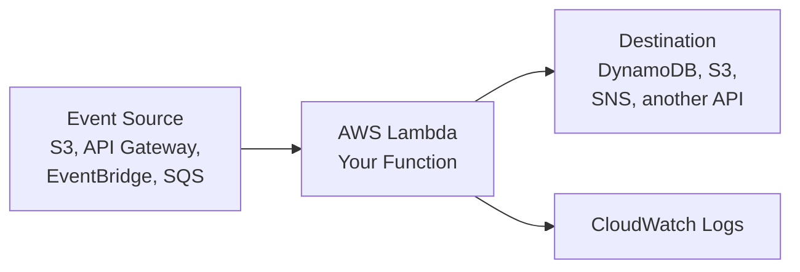

### Common triggers

- **Amazon API Gateway**: build REST/HTTP APIs
- **Amazon S3**: run code when a file is uploaded or deleted
- **Amazon EventBridge**: run on a schedule (like a cron job)
- **Amazon SQS / SNS**: process messages and notifications
- **Amazon DynamoDB Streams**: react to database changes

### Lifecycle of an invocation

| Phase | What happens |
|---|---|
| **Init** | Lambda creates the environment and loads your code (a *cold start*) |
| **Invoke** | Your handler runs and processes the event |
| **Shutdown** | The environment is frozen and may be reused for the next request (*warm start*) |

### Anatomy of a handler

```
handler(event, context)
   |        |
   |        +-- runtime info (function name, remaining time, request ID)
   +----------- input data that triggered the function (JSON)
```

---

## 3. Why Use Lambda?

- **No server management**: no patching, no capacity planning.
- **Automatic scaling**: from 1 request to thousands in parallel.
- **Cost-efficient**: billed per request and per millisecond of execution time. There is also a generous monthly free tier.
- **Event-driven integration**: connects natively with 200+ AWS services.
- **Fast development**: write a function, deploy, and you are done.
- **High availability built in**: runs across multiple Availability Zones.

### Typical use cases

- Backend for web and mobile APIs
- Image or video processing after upload to S3
- Scheduled jobs (cleanups, reports, backups)
- Real-time file and stream processing
- Automation: start/stop EC2 instances, tag resources, respond to alerts
- Chatbots and webhooks

### When *not* to use Lambda

- Jobs that run longer than **15 minutes**
- Workloads needing constant, predictable, heavy compute (EC2/ECS may be cheaper)
- Applications requiring custom OS-level control

---

## 4. Hands-On Lab: Auto-Stop EC2 Instances

A beginner-friendly DevOps task: build a Lambda function that **stops every EC2 instance tagged `AutoStop=true`**, triggered on a schedule by **EventBridge**. Forgotten running instances are a classic source of cloud waste, so this is a real-world cost-saving automation.

| | |
|---|---|
| **Services used** | Lambda, EC2, IAM, EventBridge Scheduler, CloudWatch Logs |
| **Time** | About 30 minutes |
| **Cost** | Free Tier friendly (use a `t2.micro` or `t3.micro`) |
| **Runtime** | Python 3.12 |
| **Prerequisites** | An AWS account and access to the AWS Management Console |

### Architecture

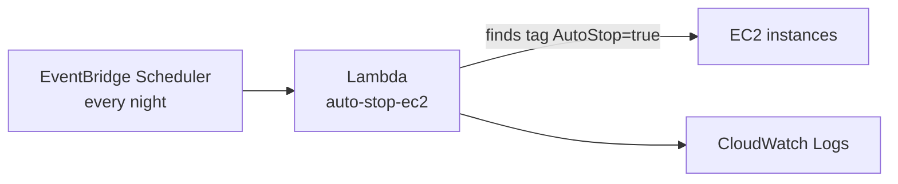

> **Note:** Create all resources in the **same AWS region**.

---

### Step 1: Create a Test EC2 Instance

1. Go to **EC2 → Launch instance**.
2. Name it `lambda-test-server`.
3. Choose **Amazon Linux** and a free-tier instance type.
4. Under **Tags**, add key `AutoStop` with value `true`.
5. Click **Launch instance** and wait until the state is **Running**.

<p align="center">
  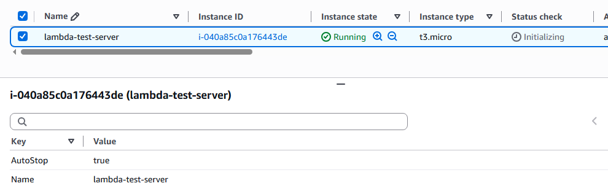
</p>

---

### Step 2: Create the Lambda Function

1. Go to **Lambda → Create function → Author from scratch**.
2. Function name: `auto-stop-ec2`.
3. Runtime: **Python 3.14**.
4. Under **Permissions**, expand **Change default execution role** and keep **Create a new role with basic Lambda permissions** selected (the default).
5. Click **Create function**.

Lambda automatically creates an IAM role named like `auto-stop-ec2-role-xxxxxxxx` with the AWS managed policy **AWSLambdaBasicExecutionRole**. This only allows the function to write logs to CloudWatch, which is why Step 3 adds EC2 permissions.

<p align="center">
  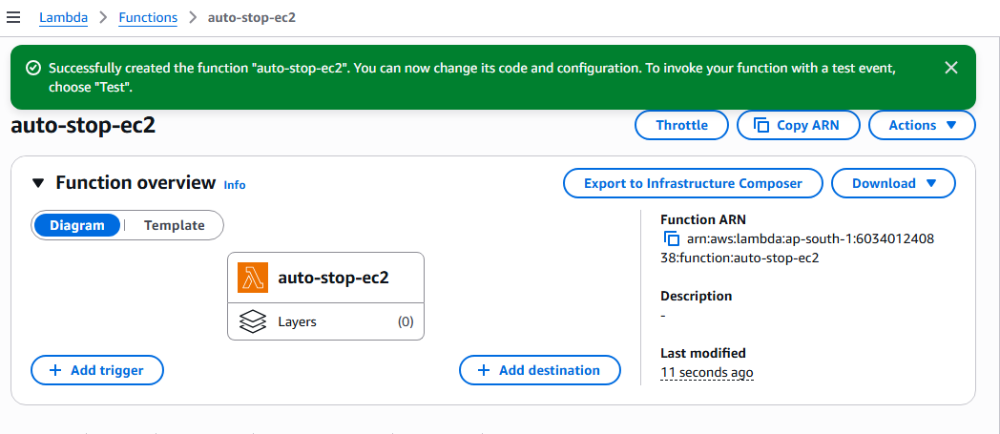
</p>

---

### Step 3: Give the Function Permission to Stop Instances

By default, the function can only write logs, so you must add EC2 permissions.

1. Open the function → **Configuration → Permissions**.
2. Click the **role name** (opens IAM).
3. Choose **Add permissions → Create inline policy → JSON** and paste:

```json
{
  "Version": "2012-10-17",
  "Statement": [
    {
      "Effect": "Allow",
      "Action": [
        "ec2:DescribeInstances",
        "ec2:StopInstances"
      ],
      "Resource": "*"
    }
  ]
}
```

4. Name the policy `ec2-auto-stop-policy` and click **Create policy**.

<p align="center">
  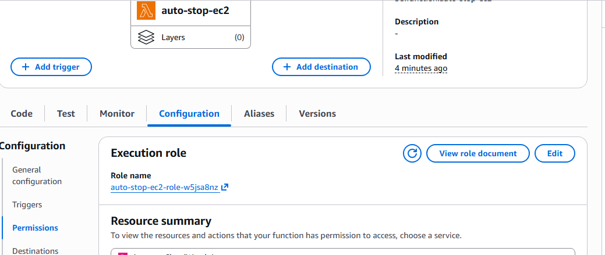
</p>

<p align="center">
  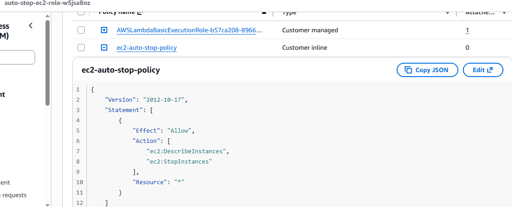
</p>

> Note: In production, restrict it to specific instances or use tag conditions.

---

### Step 4: Add the Code and Set the Timeout

1. Open the **Code** tab and paste this into `lambda_function.py`:

```python
import boto3

ec2 = boto3.client("ec2")

def lambda_handler(event, context):
    response = ec2.describe_instances(
        Filters=[
            {"Name": "tag:AutoStop", "Values": ["true"]},
            {"Name": "instance-state-name", "Values": ["running"]},
        ]
    )

    instance_ids = [
        instance["InstanceId"]
        for reservation in response["Reservations"]
        for instance in reservation["Instances"]
    ]

    if instance_ids:
        ec2.stop_instances(InstanceIds=instance_ids)
        print(f"Stopping instances: {instance_ids}")
    else:
        print("No running instances with tag AutoStop=true")

    return {"stopped": instance_ids}
```

2. Click **Deploy**.
3. Go to **Configuration → General configuration → Edit** and set **Timeout** to `30 seconds` (the default 3 seconds can be too short).

<p align="center">
  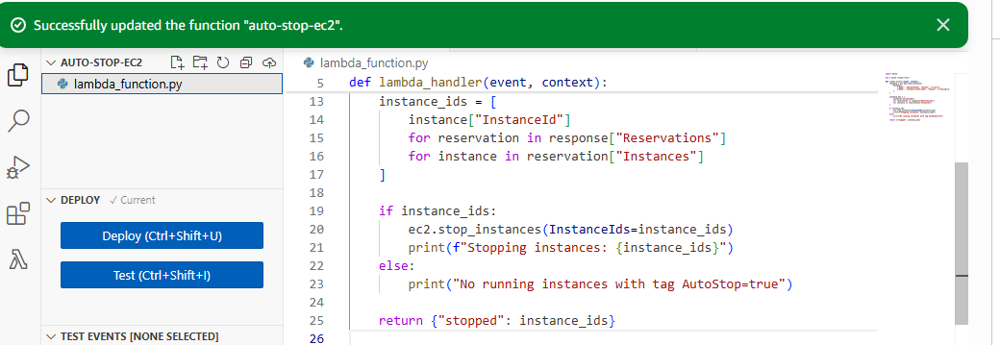
</p>

<p align="center">
  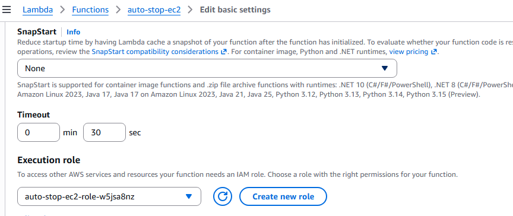
</p>

---

### Step 5: Test the Function Manually

1. Open the **Test** tab.
2. Create a new event named `manualTest` with this body:

```json
{}
```

3. Click **Test**.
4. The output should list your instance ID.
5. Go to **EC2** and confirm the instance moves from **Stopping** to **Stopped**.

<p align="center">
  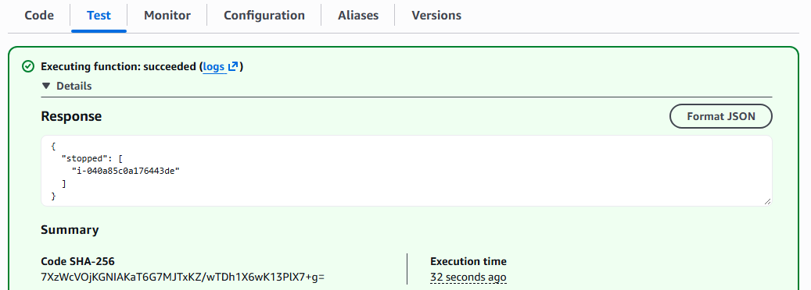
</p>

<p align="center">
  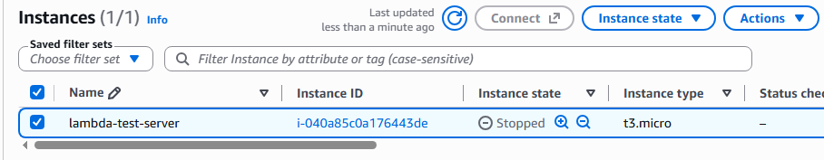
</p>

---

### Step 6: Schedule It with EventBridge

1. Start the test instance again from the EC2 console.
2. Go to **EventBridge → Scheduler → Create schedule**.
3. Name: `stop-ec2-nightly`.
4. Schedule pattern: **Recurring schedule → Cron-based**.
5. Cron expression: `0 23 * * ? *` (every day at 11 PM). Select your time zone.
   - **Flexible time window:** set to **Off** so the function runs at exactly 8 PM. (If you choose a window such as 15 minutes, EventBridge may run it at any point within that window.)
6. Target: **AWS Lambda → Invoke**, then choose `auto-stop-ec2`.
7. Let Scheduler **create a new execution role** and click **Create schedule**.

<p align="center">
  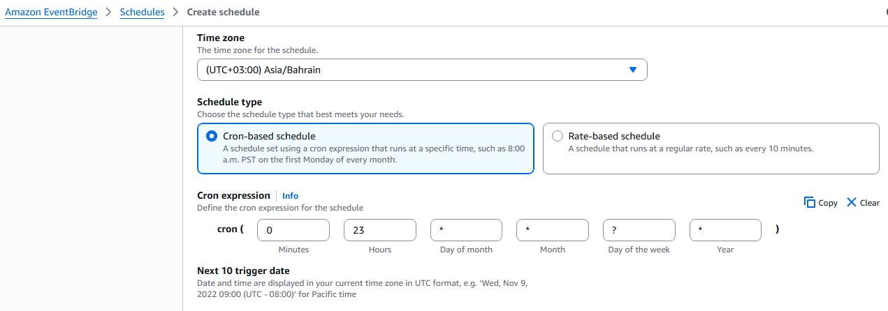
</p>

<p align="center">
  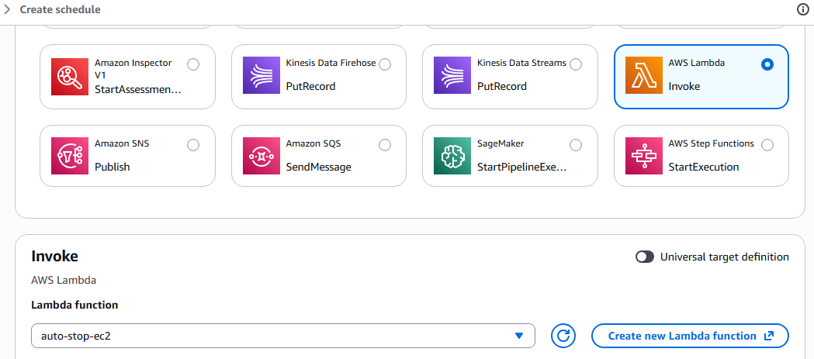
</p>

> **Quick test tip:** use `rate(5 minutes)` as the schedule to see it work without waiting until night. Delete the schedule afterwards.


---

### Step 7: Verify with CloudWatch Logs

1. Go to **CloudWatch → Log management → Log groups**.
2. Open `/aws/lambda/auto-stop-ec2`.
3. Open the latest log stream and look for `Stopping instances: [...]`.

<p align="center">
  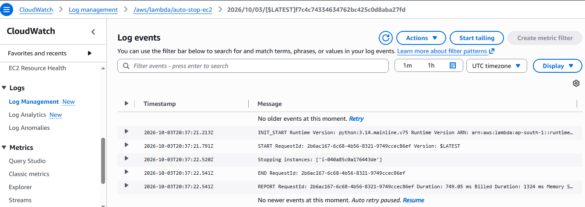
</p>

> Here I have changed the cron time 23:37 as the time (Test)

---

### Step 8: Cleanup

To avoid charges and clutter:

1. Delete the **EventBridge schedule** `stop-ec2-nightly`.
2. Delete the **Lambda function** `auto-stop-ec2`.
3. Delete its **IAM role** and the inline policy.
4. **Terminate** the test EC2 instance.
5. Delete the CloudWatch log group `/aws/lambda/auto-stop-ec2`.

---

### Troubleshooting

| Problem | Likely cause | Fix |
|---|---|---|
| `AccessDenied` / `UnauthorizedOperation` | Role is missing EC2 permissions | Re-check Step 3 |
| `Task timed out after 3.00 seconds` | Default timeout too low | Increase timeout (Step 4) |
| Output shows `"stopped": []` | No running instance with the tag | Check tag key/value is exactly `AutoStop` = `true` |
| Instance not found | Lambda and EC2 in different regions | Create both in the same region |
| Schedule never triggers | Wrong cron or time zone | Verify the expression and selected time zone |

### Stretch Goals

- Add a second schedule and function to **start** instances every morning.
- Send an **SNS email** listing the stopped instances.
- Make the tag key and value configurable with **environment variables**.
- Deploy the whole setup with **Terraform** or **AWS SAM**.

---

## 5. Notes and Key Concepts

Quick reference notes to remember.

| Concept | Meaning |
|---|---|
| **Function** | Your code plus its configuration |
| **Handler** | The entry point Lambda calls (`lambda_handler` / `handler`) |
| **Event** | JSON input that triggers and feeds the function |
| **Context** | Runtime details: request ID, remaining time, function name |
| **Runtime** | The language environment (Python, Node.js, Java, .NET, Ruby, custom) |
| **Execution role (IAM)** | Permissions the function has to access other AWS services |
| **Trigger** | The service that invokes your function |
| **Layer** | A shared package of libraries or dependencies for multiple functions |
| **Environment variables** | Key-value settings used to configure code without changing it |
| **Cold start** | Extra startup time when a new environment is created |
| **Concurrency** | Number of function instances running at the same time |
| **Version / Alias** | Immutable snapshots of your function and friendly pointers (e.g. `prod`) |

### Key limits to know (default values; check AWS docs for the latest)

| Item | Limit |
|---|---|
| Maximum timeout | **15 minutes** |
| Memory | 128 MB to 10,240 MB (CPU scales with memory) |
| Ephemeral storage (`/tmp`) | 512 MB up to 10,240 MB |
| Deployment package (zip) | 50 MB zipped (direct upload), 250 MB unzipped |
| Container image size | Up to 10 GB |
| Default concurrency | 1,000 per region (can be increased) |

### Pricing in short

You are charged for:

- **Number of requests**
- **Duration** (in milliseconds) multiplied by the **memory allocated**

The free tier includes 1 million requests and 400,000 GB-seconds of compute per month. Verify current pricing on the [AWS Lambda pricing page](https://aws.amazon.com/lambda/pricing/).

---

## 6. Best Practices

- **Follow least privilege**: give the execution role only the permissions it needs.
- **Keep functions small**: one function, one job.
- **Use environment variables** for config, and **AWS Secrets Manager** for secrets.
- **Set sensible timeouts and memory**: test to find the best cost/performance balance.
- **Reuse connections**: initialize SDK clients outside the handler.
- **Handle errors and retries**: use Dead Letter Queues (DLQ) or destinations for failed events.
- **Monitor**: use CloudWatch Logs, Metrics, and Alarms (and X-Ray for tracing).
- **Use Infrastructure as Code**: manage functions with Terraform, AWS SAM, or CloudFormation.

---

## 7. Further Reading

- [AWS Lambda Developer Guide](https://docs.aws.amazon.com/lambda/latest/dg/welcome.html)
- [AWS Lambda Pricing](https://aws.amazon.com/lambda/pricing/)
- [AWS SAM (Serverless Application Model)](https://aws.amazon.com/serverless/sam/)
- [Serverless Land](https://serverlessland.com/)

---

## Next Steps

- Connect Lambda to **API Gateway** and build a simple REST API.
- Trigger a function from an **S3 upload** event.
- Add a second schedule to **start** instances every morning.
- Deploy your function using **Terraform** or **AWS SAM**.

---

*If you found this guide useful, give the repo a star and share your feedback.*