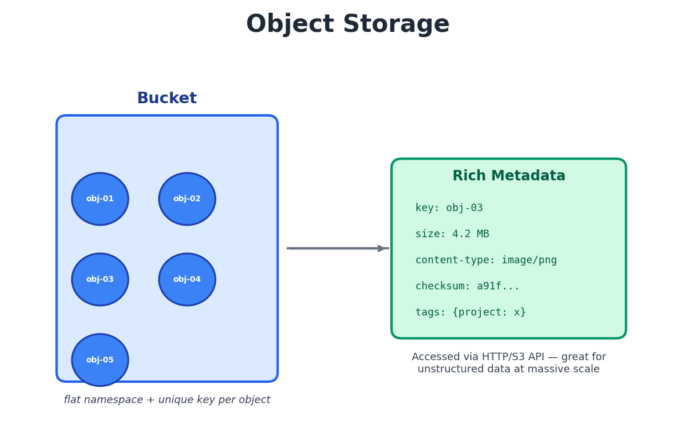
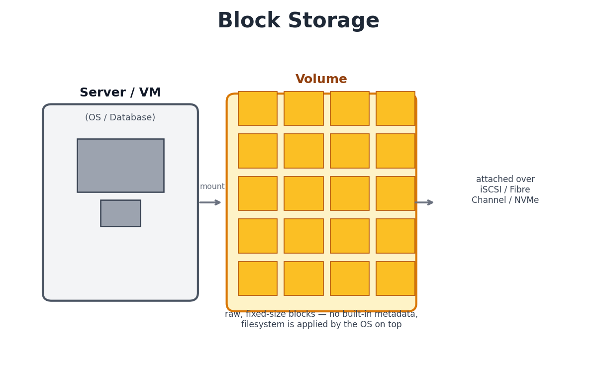
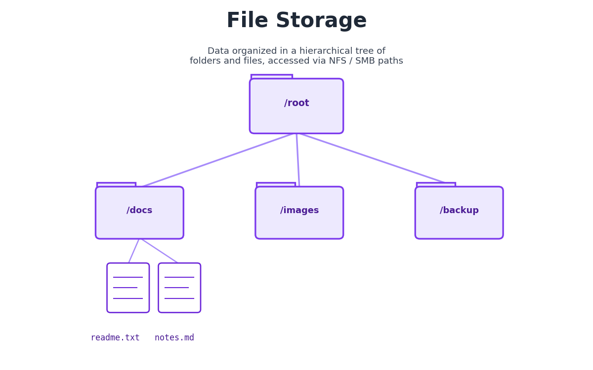

# Types of Storage: Object, Block, and File

Every application, database, and server ultimately needs somewhere to persist data — and the way that data is organized, accessed, and scaled depends on the storage type behind it. In cloud and DevOps work, understanding the differences between **Object**, **Block**, and **File** storage is fundamental to designing systems correctly.

This guide breaks down all three, how they work, and when to use each one.

---

## 1. Object Storage

Object storage stores each piece of data as its own separate, independent unit called an **object** — nothing is broken up or spread across multiple files. Each object holds three things together: the actual file content (e.g., the contents of a photo or video), a unique identifier called a **key**, and metadata (extra descriptive details about the file, like its size or type). Objects are stored inside a flat container called a **bucket** — there are no folders or subfolders. Instead, you retrieve any object directly using its key, typically through an HTTP-based API.

### Key characteristics
- **Flat namespace** — no nested directory structure, just buckets full of keyed objects
- **Rich, customizable metadata** attached to every object (content-type, tags, checksums, etc.)
- **Massively scalable** — designed to hold billions of objects across distributed nodes
- **Accessed via API** (e.g., REST/S3 API) rather than a traditional filesystem mount
- Usually **immutable** — objects are replaced wholesale rather than edited in place

### Common use cases
- Storing images, videos, backups, and static website assets
- Data lakes and big data analytics
- Application logs and archival/cold storage
- Distributing static content via a CDN

### Examples
Amazon S3, Google Cloud Storage, Azure Blob Storage, MinIO

---

## 2. Block Storage

Block storage splits data into fixed-size **blocks**, each with its own address, and presents them as a raw **volume** — much like a physical hard drive. The operating system attaches the volume, formats it with a filesystem, and manages files on top of it. Because there's no built-in awareness of "files," block storage delivers very low latency and high I/O performance.

### Key characteristics
- Data is stored in **fixed-size blocks**, addressed individually — no inherent structure or metadata
- Delivers **low latency and high throughput**, ideal for demanding, transactional workloads
- A volume behaves like a **raw disk** — the OS applies a filesystem (ext4, NTFS, etc.) on top
- Typically attached to a **single server/VM** at a time (though some solutions support shared access)
- Fully **mutable** — supports in-place random reads/writes, unlike object storage

### Common use cases
- Databases (MySQL, PostgreSQL, MongoDB) that need fast, consistent I/O
- Boot volumes / root disks for virtual machines
- Enterprise applications like ERP and SAP systems
- Any workload requiring high-performance, low-latency disk access

### Examples
Amazon EBS, Google Persistent Disk, Azure Managed Disks, SAN (Storage Area Network) systems

---

## 3. File Storage

File storage organizes data in a familiar **hierarchical structure** of folders, subfolders, and files — the same model used on a personal computer. Multiple clients can mount the same file share simultaneously and access files using standard paths, making it ideal for shared, collaborative access.

### Key characteristics
- Data organized as a **directory tree** (folders → subfolders → files)
- Accessed using **standard file-system protocols** like NFS (Linux) or SMB/CIFS (Windows)
- Supports **concurrent, shared access** by multiple clients/servers at once
- Simple and intuitive — mirrors how most people already think about files
- Built-in file-level permissions and locking for multi-user environments

### Common use cases
- Shared drives for team collaboration and content management
- Home directories in enterprise environments
- Application configuration and shared media files
- Lift-and-shift migrations of legacy apps that expect a traditional filesystem

### Examples
Amazon EFS, Azure Files, Google Filestore, NFS/SMB file servers

---

## Quick Comparison

| Feature            | Object Storage              | Block Storage                | File Storage                  |
|---------------------|------------------------------|-------------------------------|--------------------------------|
| **Data unit**       | Object (data + metadata)     | Fixed-size block               | File within a folder hierarchy |
| **Structure**       | Flat namespace               | Raw volume (no structure)      | Hierarchical directory tree    |
| **Access method**   | HTTP/REST API                | Block-level protocol (iSCSI, FC, NVMe) | Network file protocol (NFS/SMB) |
| **Performance**     | Higher latency, huge scale   | Lowest latency, high IOPS      | Moderate latency, good for shared access |
| **Mutability**      | Typically immutable          | Fully mutable                  | Fully mutable                  |
| **Best for**        | Unstructured data at scale   | Databases, VM disks            | Shared files, collaboration    |
| **Cloud examples**  | S3, GCS, Azure Blob          | EBS, Persistent Disk, Azure Disk | EFS, Azure Files, Filestore   |

---

## Choosing the Right Storage Type

- Need to store **unstructured data at massive scale** with API access? → **Object Storage**
- Need **fast, low-latency disk access** for a database or VM? → **Block Storage**
- Need **shared folders** multiple servers or users can access at once? → **File Storage**

In real-world architectures, it's common to combine all three — for example, block storage for a database's data volume, file storage for shared application configs, and object storage for backups and static assets.

---

*Written as part of ongoing DevOps and Cloud learning notes.*