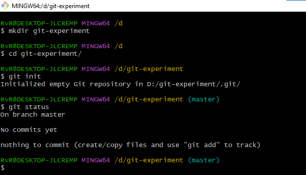

# Task 1: Repository Setup

## Create Project Directory

Command:
```bash
mkdir git-experiment
```
## Move to the Directory
```bash
cd git-experiment
```
## Initialize Git
```bash
git init
```
## Verify
```bash
git status
```

## Screenshot


