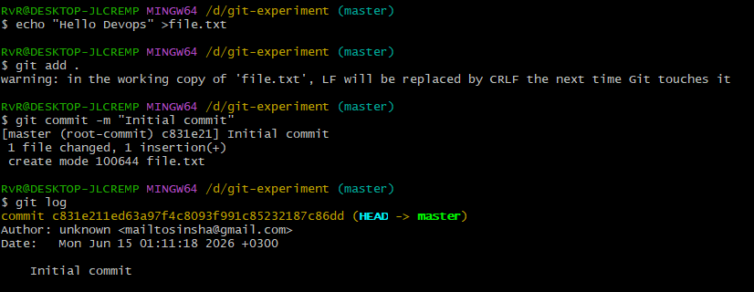

# Task 2: First Commit


Create file:
```bash
echo "Hello DevOps" > file.txt
```

Add:
```bash
git add .
```

Commit:
```bash
git commit -m "Initial commit"
```

Verify:
```bash
git log
```

## Screenshot


