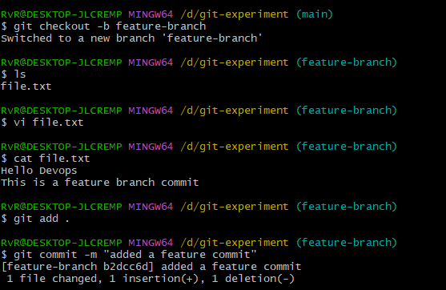
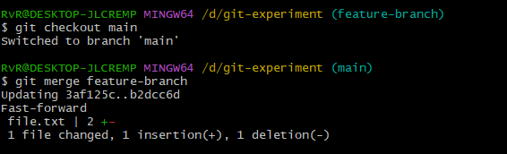

# Task 3: Branch Workflow


Create branch:
```bash
git checkout -b feature-login
```
Check branches:

add file and commit:

```bash
git add .

git commit -m "added feature login"
```
Screenshot:



Merge:

git checkout main

git merge feature-login


Screenshot:


